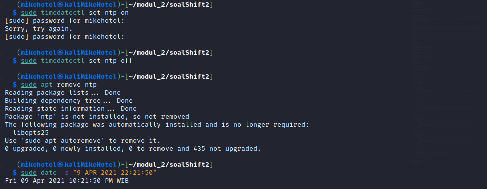
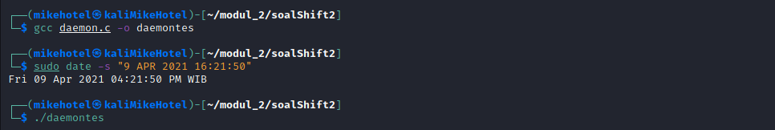
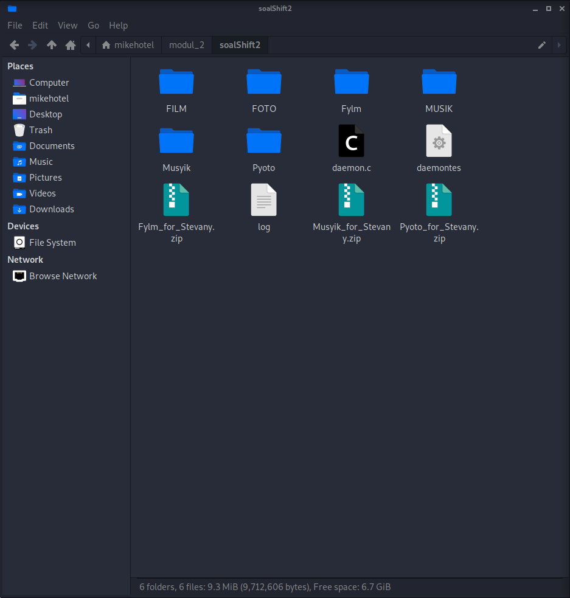
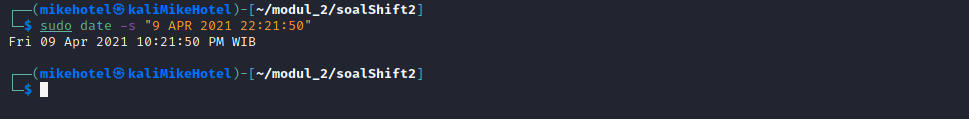
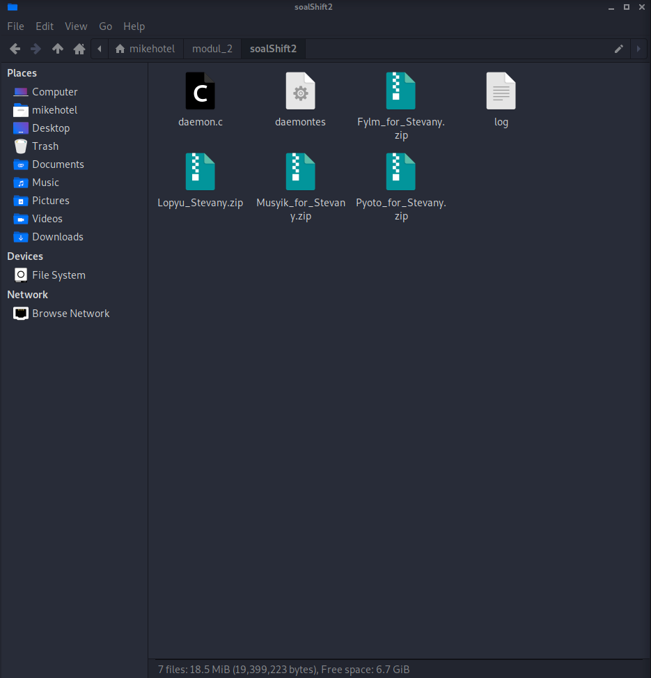

# soal-shift-sisop-modul-2-IT02-2021

Penjelasan dan penyelesaian Soal Shift 2 Sistem Operasi 2021\
Kelompok IT02

1. Muhammad Hilmi Ramadhan (05311940000044)
2. Lambang Akbar Wijayadi (05311940000006)
3. Mulki Kusumah (05311940000043)

---

## Daftar Isi

- [Soal 1](#soal-1)

  - [Soal 1.a.](#soal-1a)
  - [Soal 1.b.](#soal-1b)
  - [Soal 1.c.](#soal-1c)
  - [Soal 1.d.](#soal-1d)
  - [Soal 1.e.](#soal-1e)
  - [Soal 1.f.](#soal-1f)

- [Soal 2](#soal-2)

  - [Soal 2.a.](#soal-2a)
  - [Soal 2.b.](#soal-2b)
  - [Soal 2.c.](#soal-2c)
  - [Soal 2.d.](#soal-2d)
  - [Soal 2.e.](#soal-2e)

- [Soal 3](#soal-3)
  - [Soal 3.a.](#soal-3a)
  - [Soal 3.b.](#soal-3b)
  - [Soal 3.c.](#soal-3c)
  - [Soal 3.d.](#soal-3d)
  - [Soal 3.e.](#soal-3e)

---

## Soal 1

Source Code tersedia pada : [soal1.c](./soal1/soal1.c)

## **Analisa Soal**

Secara umum, kami menangkap bahwa program yang harus dibuat merupakan sebuah _daemon process_ yang mana dapat berjalan pada 09 April 2021 pukul 16:22:00 dan pukul 22:22:00 WIB GMT+7. Adapun secara spesifik soal tersebut terbagi menjadi beberapa bagian diantaranya :

1. Membuat 3 folder dengan nama spesifik (Musyik, Fylm, Pyoto).
2. Melakukan pengunduhan otomisasi dari link yang tersedia pada soal.
3. Meng-ekstrak dari file yang telah diunduh atau proses _unzip_
4. Memindahkan file yang telah diekstrak ke dalam folder yang telah dibuat pada point nomor 1.
5. Point-point sebelum point ini berjalan secara otomisasi pada 6 jam sebelum ulang tahun dari Stevany, yang mana ulang tahun dari Stevany adalah 9 April pukul 22:22:00 WIB GMT+7. Sehingga dijalankan pada pukul 16:22:00 WIB GMT+7
6. Pada saat waktu ulang tahun Stevany semua folder yang telah dibuat dan terisi di _zip_ dengan nama Lopyu_Stevany.zip dan selain folder dengan eksternsi `.zip` maka akan terhapus.

Hal-hal yang perlu diperhatikan diantaranya :\

1. Seluruh soal 1 dijalankan di latar belakang (_daemon process_)
2. Dilarang menggunakan fungsi `system()`, `mkdir()`, `rename()` yang tersedia pada Bahasa C, dan `cron`.
3. Gunakan `fork()`, `exec()`, `wait()`, dan `sleep()`.
4. Pergunakan link, video, dan tips lainnya yang ada pada soal.

<br>
**Cara pengerjaan**
---

Dalam membuat program Bahasa C yang berjalan di latar belakang/*background*, pertama-tama yang diperlukan adalah melakukan *import* library yang digunakan :
```c
#include <sys/types.h>
#include <sys/stat.h>
#include <sys/wait.h>
#include <stdio.h>
#include <stdlib.h>
#include <fcntl.h>
#include <errno.h>
#include <unistd.h>
#include <syslog.h>
#include <string.h>
#include <time.h>
```
- `<sys/types.h>` library tipe data khusus (e.g. `pid_t`)
- `<sys/stat.h>` Library untuk melakukan pengembalian dari status waktu (e.g. `time_t()`)
- `<sys/wait.h>` Library untuk melakukan _wait_ (e.g. `wait()`)
- `<stdio.h>` library untuk fungsi input-output (e.g. `printf(), sprintf()`)
- `<stdlib.h>` library untuk fungsi umum (e.g. `exit(), atoi()`)
- `<fcntl.h>` library untuk proses id dalam proses kunci (e.g. `pid_t()`)
- `<errno.h>` library untuk memberikan tambahan error pada sistem yang sesuai dengan IEEE Std 1003.1-2001  (e.g. `ECHILD`)
- `<unistd.h>` library untuk melakukan system call kepada kernel linux (e.g. `fork()`)
- `<syslog.h>` library untuk mengirimkan pesan ke *system logger* (e.g. `openlog()`)
- `<string.h>` library untuk melakukan manipulasi *arrays of character* (e.g. `*memset()`)
- `<time.h>` library untuk melakukan manipulasi date dan time (e.g. `time(), strftime()`)

<br>
Selanjutnya, pada awal dari logika `main function` program ini melakukan validasi waktu yang pertama bahwa waktu yang sesuai dengan `epoch time unix` yang di set pada 9 April 2021 16:22:00 yang mana sesuai dengan keinginan dari Steven agar program berjalan otomatis 6 jam sebelum waktu ulang tahun Stevany.

```c
time_t t = time(NULL);
    while (t != 1617960119)
    {

        t = time(NULL);
    }
```
_catatan : maksud dari 1617960119 adalah waktu program ini akan dijalankan yaitu 9 April 2021 16:22:00 dalam format *time in unix*_

Lalu kami harus membuat program ini menjadi sebuah *daemon process* atau proses yang berjalan di latar belakang.
```c
    pid_t ortuid, anakid;
    ortuid = fork();

    if (ortuid < 0)
    {
        exit(EXIT_FAILURE);
    }

    if (ortuid > 0)
    {
        exit(EXIT_SUCCESS);
    }
```
_catatan : Disini kita melakukan `fork()` yang bertujuan agar menghasilkan *parent process* dengan variable `ortuid` yang berisi `PID` dari *child process*nya. *Child process* dengan variable `ortuid` berisi *value* 0. Kemudian, *parent process* akan di keluarkan dengan fungsi `exit()` dengan statusnya._

Selanjutnya mengubah mode file
```c
 umask(0);
 ```
 _catatan : hal ini dilakukan dengan tujuan kita mendapatkan *full access* terhadap file yang telah dibuat oleh daemon._

Setelah itu, membuat *Unique Session ID* `(SID)`
```c
anakid = setsid();
    if (anakid < 0)
    {
        exit(EXIT_FAILURE);
    }
```
_catatan : Tanpa adanya `SID`, *child process* yang *parent* nya telah di-`kill` akan menjadi *Orphan Process*._

Lalu kami harus menentukan *working directory* target dari jalannya proses ini dengan bantuan fungsi `chdir()`
```c
 if ((chdir("/home/mikehotel/modul_2/soalShift2/")) < 0)
    {
        exit(EXIT_FAILURE);
    }
```
_catatan : dengan mengubah ke alamat *directory* tersebut, maka segala hasil proses dari program ini akan tersedia disana._

Tak lupa kami menutup *File Descriptor* Standar 
```c
 close(STDIN_FILENO);
 close(STDOUT_FILENO);
 close(STDERR_FILENO);
```
_catatan : Inti dari ketiga `file descriptor` ini adalah tidak memunculkan pesan pada *user* contohnya pada terminal._
<br>

## Soal 1.a.
## **Analisa Soal**
Pada soal a, kami diminta untuk membuat sebuah direktori dengan menggunakan `fork()` dan `execv()`. Direktori yang dibuat diantaranya yaitu `Musyik` untuk ekstensi `.mp3`, `Fylm` untuk ekstensi `.mp4`, dan `Pyoto` untuk ekstensi `.jpg`.

**Cara Pengerjaan**
---
Dalam menjawab soal 1.a. kami membuat *child process* dengan variable `ortuid` untuk melakukan pembuatan dari `directory` yang diminta.
```c
  ortuid = fork();
    if (ortuid == 0)
    {
        char *argv[] = {"mkdir", "Musyik", "Pyoto", "Fylm", NULL};
        execv("/bin/mkdir", argv);
    }
    while (wait(NULL) != ortuid)
        ;
```
_catatan : Setelah tereksekusi pembuatan dari `directory` tersebut maka *parent process* akan menunggu *child process* nya selesai._

<br>

## Soal 1.b.
## **Analisa Soal**
Selanjunya di soal b, kami diminta untuk melakukan pengunduhan/*download* baik itu dari musik, film, dan foto dari link yang tertera pada Soal Shift 2 bagian Note.

**Cara Pengerjaan**
---
Guna menyelesaikan permasalahan b, kami mengikuti arahan dari Tips dengan menggunakan *command* `wget`. Disamping itu kami juga menggunakan `fork()` dan `execv()`. Yang mana dari masing-masing setiap proses mendownload kami proses penggantian nama `file.zip` dengan nama file yang telah kami khususkan masing-masing seperti Foto menjadi `Pyoto_for_Stevanny.zip`, Film menjadi `Fylm_for_Stevanny.zip`, dan Musik menjadi `Musyik_for_Stevanny.zip`.
```c
ortuid = fork();
    if (ortuid == 0)
    {
        char *argv[] = {"wget", "--no-check-certificate", "https://drive.google.com/uc?id=1FsrAzb9B5ixooGUs0dGiBr-rC7TS9wTD&export=download", "-O", "Pyoto_for_Stevany.zip", "-o", "log", NULL};
        execv("/usr/bin/wget", argv);
    }
    while (wait(NULL) != ortuid)
        ;

    ortuid = fork();
    if (ortuid == 0)
    {
        char *argv[] = {"wget", "--no-check-certificate", "https://drive.google.com/uc?id=1ktjGgDkL0nNpY-vT7rT7O6ZI47Ke9xcp&export=download", "-O", "Fylm_for_Stevany.zip", "-o", "log", NULL};
        execv("/usr/bin/wget", argv);
    }
    while (wait(NULL) != ortuid)
        ;

    ortuid = fork();
    if (ortuid == 0)
    {
        char *argv[] = {"wget", "--no-check-certificate", "https://drive.google.com/uc?id=1ZG8nRBRPquhYXq_sISdsVcXx5VdEgi-J&export=download", "-O", "Musyik_for_Stevany.zip", "-o", "log", NULL};
        execv("/usr/bin/wget", argv);
    }
    while (wait(NULL) != ortuid)
        ;
```
_catatan : Secara konseptual hal ini sama dengan penyelesaian pada [soal 1.a.](#soal-1.a.). Karena posisi dari `PID` merupakan masih diluar dari  `while big loop` dari *daemon process*.

<br>

## Soal 1.c.
## **Analisa Soal**
Pada soal c ini, kami diminta untuk melakukan peng-ekstrakan atau `unzip` dari `file` yang telah di *download* tadi.

**Cara Pengerjaan**
---
Dalam menjawab soal 1.c. kami menyelesaikannya dengan bantuan dari fungsi `fork()` dan `execv()` dalam melakukan eksekusinya. Proses dijalankan oleh *child process* dengan variable `ortuid` yang mana *parent process* akan menunggu hingga *child process* selesai bekerja oleh karena itu kami juga menggunakan bantuan dari fungsi `wait()`.
```c
 ortuid = fork();
    if (ortuid == 0)
    {
        sleep(20);
        char *argv[] = {"unzip", "Musyik_for_Stevany.zip", NULL};
        execv("/usr/bin/unzip", argv);
    }
    while (wait(NULL) != ortuid)
        ;

    ortuid = fork();
    if (ortuid == 0)
    {
        sleep(20);
        char *argv[] = {"unzip", "Pyoto_for_Stevany.zip", NULL};
        execv("/usr/bin/unzip", argv);
    }
    while (wait(NULL) != ortuid)
        ;

    ortuid = fork();
    if (ortuid == 0)
    {
        sleep(20);
        char *argv[] = {"unzip", "Fylm_for_Stevany.zip", NULL};
        execv("/usr/bin/unzip", argv);
    }
    while (wait(NULL) != ortuid)
        ;
```
_catatan : pada proses dari `unzip file` kami secara konseptual serupa dengan nomor sebelumnya baik itu 1.a dan 1.b yang mengandalkan terhadap fungsi-fungsi terkait dan memanipulasinya dengan fungsi `wait()` agar dapat berjalan berulang kali pada *child process yang* sama._

<br>

## Soal 1.d.

## **Analisa Soal**
Di soal d, kami diminta untuk memindahkan `file-file` yang telah dilakukan `unzip` ke dalam folder yang telah dibuat pada nomor 1.a. Akan tetapi hal ini secara tidak langsung berkaitan terhadap soal nomor 1.f yang mana akan menghapus segala folder terkecuali dengan ekstensi akhir yaitu `.zip`. 

**Cara Pengerjaan**
---
Sebelum dapat berlanjut, dikarenakan Steven menginginkan proses dari zip dijalankan pada waktu ulang tahun Stevanny yaitu pada 9 April 2021 pukul 22:22:00 WIB GMT+7. Maka kami membuat semacam batas logika dengan waktu terkait
```c
 while (t != 1617981719)
    {

        t = time(NULL);
    }
```
_catatan : Pada `while loop` ini disini kami ingin melakukan pengecekan bahwa proses baik itu melakukan pemindahan file yang telah di zip ke dalam file yang telah dibuat pada nomor 1.a dan proses `zip` pada nomor 1.f. itu berjalan pada 9 April 2021 22:22:00 WIB GMT+7._

Lalu setelah dilakukan pengecekan waktu pukul 22:22:00 WIB GMT+7, maka kami menaruh logika untuk baik itu pemindahan file ke folder yang diharapkan, proses peng-compressan atau `zip file` pada `while big loop` yang ada dari *daemon process* serta juga mendefinisikan sebuah proses baru yang nantinya akan berjalan pada perulangan ini.
```c
while (1)
    {

        pid_t cucuid;
        cucuid = fork();
        int status = 5;

```
_catatan : Disini kami memerlukan sebuah child process yang baru pada `daemon process` dikarenakan `child process` dari `ortuid` telah menjadi `daemon process`. Yang nantinya child process baru dengan nama variable `cucuid` akan menjalankan proses-proses seperti melakukan penghapusan folder, pemindahan file dari folder ke folder yang sesuai, dan hingga proses akhir yaitu melakukan peng-compress an atau `zip file` untuk Stevanny._

Selanjutnya, dikarenakan kami sendiri sebetulnya sedikit terkendala ketika melakukan pemindahan hanya `file` saja kepada folder yang telah ada, maka kami memutuskan untuk menghapus folder-folder yang telah dibuat pada nomor 1.a terelebih dahulu.
```c
        while (status == 5)
        {
            if (cucuid == 0)
            {
                sleep(15);
                char *argv[] = {"rm", "-r", "/home/mikehotel/modul_2/soalShift2/Fylm", "/home/mikehotel/modul_2/soalShift2/Pyoto", "/home/mikehotel/modul_2/soalShift2/Musyik", NULL};
                execv("/usr/bin/rm", argv);
            }
            status++;
        }
      while (wait(NULL) > 0);

```
_catatan : Disini kami menggunakan bantuan dari variabel `status` yang sifatnya seperti open gate memasuki dari perulangan yang akan melakukan penghapusan folder yang telah dibuat dan diakhir akan dilakukan increment dari variable tersebut agar setelah dilakukan manipulasi selesai proses menggunakan bantuan dari fungsi `wait()` tidak dapat memasuki perulangan ini lagi._


Kemudian inti dari pemindahan `file` yang diinginkan terhadap `folder` yang sesuai dengan nama masing-masing ekstensi akan terjadi pada proses program dibawah ini
```c
        cucuid = fork();

        while (status == 6)
        {
            if (cucuid == 0)
            {
                sleep(40);
                char *argv[] = {"mv", "/home/mikehotel/modul_2/soalShift2/FILM", "/home/mikehotel/modul_2/soalShift2/Fylm", NULL};
                execv("/usr/bin/mv", argv);
            }
            status++;
        }

        
        while (wait(NULL) > 0)
            ;

        cucuid = fork();

        while (status == 7)
        {
            if (cucuid == 0)
            {
                sleep(40);
                char *argv[] = {"mv", "/home/mikehotel/modul_2/soalShift2/MUSIK", "/home/mikehotel/modul_2/soalShift2/Musyik", NULL};
                execv("/usr/bin/mv", argv);
            }
            status++;
        }

        while (wait(NULL) > 0);

        cucuid = fork();

        while (status == 8)
        {
            if (cucuid == 0)
            {
                sleep(30);
                char *argv[] = {"mv", "/home/mikehotel/modul_2/soalShift2/FOTO", "/home/mikehotel/modul_2/soalShift2/Pyoto", NULL};
                execv("/usr/bin/mv", argv);
            }
            status++;
        }

        while (wait(NULL) != cucuid);
```
_catatan : Masih menggunakan konsep yang sama untuk pembatasan dengan variable `status` dan memanipulasi selesai atau menunggunya sebuah proses dengan menggunakan `while(wait(NULL) > 0);` pada antar proses pemindahan baik itu dari Foto ke Pyoto, Musik ke Musyik, dan Film ke Fylm. Akan tetapi pada akhir proses pemindahan FOTO ke Pyoto kami memanipulasi selesai atau menunggu sebuah proses dengan `while(wait(NULL) != cucuid);` yang mana nantinya akan memberikan nilai `return` -1 yang menandakan bahwa proses dari cucuid telah selesai._

<br>

## Soal 1.e.

## **Analisa Soal**
Di soal e, kami diminta untuk melakukan otomisasi program ketika waktu pada 9 April 2021 pukul 16:22:00 WIB  GMT+7. Yang mana seluruh program berjalan kecuali pada program `zip file` kembali dari file yang telah di download, ekstrak, dan dipindahkan ke folder sebagaimana mestinya karena hal ini akan dijalankan pada 9 April 2021 pukul 22:22:00 WIB GMT+7. 

**Cara Pengerjaan**
---
Sejatinya soal e secara tidak langsung telah terjawab pada penjelasan [Soal 1](#soal-1) dibagian awal dari `main function` dalam pengecekan logika waktu yang akan menyesuaikannya
```c
time_t t = time(NULL);
    while (t != 1617960119)
    {

        t = time(NULL);
    }
```
_catatan : Maksud dari 1617960119 adalah waktu program ini akan dijalankan yaitu 9 April 2021 16:22:00 dalam format time Epoch in unix_

<br>

## Soal 1.f.

## **Analisa Soal**
Pada soal F, kami diminta untuk melakukan peng-*compressan* atau `zip file` dari folder yang telah di pindahkan pada [Soal 1.d.](#soal-1d) dan penghapusan pada semua folder yang ada terkecuali pada `file` ekstensi `.zip` .

**Cara Pengerjaan**
---
Secara konsep soal ini masih menggunakan fungsi `sleep()`, `wait()`, dan `execv`. Akan tetapi dengan menggunakan *command* `zip` dengan *argumen* kedua `-rm` dengan maksud setelah proses `zip` atau peng-*compress*an selesai maka folder akan dihapus.
```c
        while (status == 9)
        {
            sleep(80);
            char *argv[] = {"zip", "-rm", "Lopyu_Stevany", "Pyoto", "Musyik", "Fylm", NULL};
            execv("/bin/zip", argv);
        }
        status++;

        while (wait(NULL) > 0)
            ;

        sleep(10);
    }
    exit(EXIT_SUCCESS);
}
```
_catatan : di akhir dari proses ini berjalan kami melakukan `sleep(10)` dan menyelesaikan dari proses `SID` pada `while big loop` dari `daemon process` dan selesai sudah semuanya._
<br>

**Kendala**
---

Awalnya dari kelompok kami mengalami kesulitan dalam memahami program Daemon sendiri. Diawal kami melakukan kesalahan dengan melakuan sangat banyak forking diawal yang jika dijalankan pada daemon akibatnya membuat OS kami sangat lemot dan terpaksa harus di kill manual dari main OS.

<br>

**Screenshoot konfigurasi waktu guna menjalankan program ini**\

---

<br>

**Screenshoot proses *run program* pada pukul 16:22:00**\

---

<br>

**Screenshoot hasil jalannya program pada 9 April 2021 pukul 16:22:00**\

---

<br>

**Screenshoot proses *run program* pada pukul 22:22:00**\

---

<br>

**Screenshoot hasil jalannya program pada 9 April 2021 pukul 22:22:00**\

---

<br>
<br>

## Soal 2

Source Code tersedia pada : [soal2.c](./soal2/soal2.c)

## **Analisa Soal**


<br>

**Cara pengerjaan**
---


## Soal 2.a.
## **Analisa Soal**

**Cara Pengerjaan**
---

<br>


## Soal 2.b.
## **Analisa Soal**

**Cara Pengerjaan**
---


<br>

## Soal 2.c.
## **Analisa Soal**

**Cara Pengerjaan**
---


<br>

## Soal 2.d.
## **Analisa Soal**

**Cara Pengerjaan**
---


<br>

## Soal 2.e.
## **Analisa Soal**

**Cara Pengerjaan**
---

<br>


**Kendala**
---

<br>

**Screenshoot**


<br>
<br>

## Soal 3

Source Code tersedia pada : [soal2.c](./soal2/soal2.c)

## **Analisa Soal**


<br>

**Cara pengerjaan**
---


## Soal 3.a.
## **Analisa Soal**

**Cara Pengerjaan**
---

<br>


## Soal 3.b.
## **Analisa Soal**

**Cara Pengerjaan**
---


<br>

## Soal 3.c.
## **Analisa Soal**

**Cara Pengerjaan**
---


<br>

## Soal 3.d.
## **Analisa Soal**

**Cara Pengerjaan**
---


<br>

## Soal 3.e.
## **Analisa Soal**

**Cara Pengerjaan**
---

<br>


**Kendala**
---

<br>

**Screenshoot**