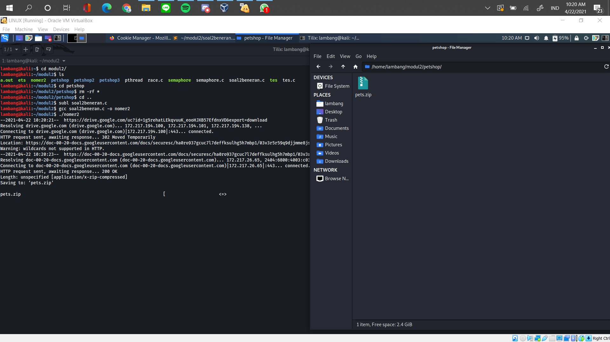

# soal-shift-sisop-modul-2-IT02-2021

Penjelasan dan penyelesaian Soal Shift 2 Sistem Operasi 2021\
Kelompok IT02

1. Muhammad Hilmi Ramadhan (05311940000044)
2. Lambang Akbar Wijayadi (05311940000006)
3. Mulki Kusumah (05311940000043)

---

## Daftar Isi

- [Soal 1](#soal-1)

  - [Soal 1.a.](#soal-1a)
  - [Soal 1.b.](#soal-1b)
  - [Soal 1.c.](#soal-1c)
  - [Soal 1.d.](#soal-1d)
  - [Soal 1.e.](#soal-1e)
  - [Soal 1.f.](#soal-1f)

- [Soal 2](#soal-2)

  - [Soal 2.a.](#soal-2a)
  - [Soal 2.b.](#soal-2b)
  - [Soal 2.c.](#soal-2c)
  - [Soal 2.d.](#soal-2d)
  - [Soal 2.e.](#soal-2e)

- [Soal 3](#soal-3)
  - [Soal 3.a.](#soal-3a)
  - [Soal 3.b.](#soal-3b)
  - [Soal 3.c.](#soal-3c)
  - [Soal 3.d.](#soal-3d)
  - [Soal 3.e.](#soal-3e)

---

## Soal 1

Source Code tersedia pada : [soal1.c](./soal1/soal1.c)

## **Analisa Soal**

Secara umum, kami menangkap bahwa program yang harus dibuat merupakan sebuah _daemon process_ yang mana dapat berjalan pada 09 April 2021 pukul 16:22:00 dan pukul 22:22:00 WIB GMT+7. Adapun secara spesifik soal tersebut terbagi menjadi beberapa bagian diantaranya :

1. Membuat 3 folder dengan nama spesifik (Musyik, Fylm, Pyoto).
2. Melakukan pengunduhan otomisasi dari link yang tersedia pada soal.
3. Meng-ekstrak dari file yang telah diunduh atau proses _unzip_
4. Memindahkan file yang telah diekstrak ke dalam folder yang telah dibuat pada point nomor 1.
5. Point-point sebelum point ini berjalan secara otomisasi pada 6 jam sebelum ulang tahun dari Stevany, yang mana ulang tahun dari Stevany adalah 9 April pukul 22:22:00 WIB GMT+7. Sehingga dijalankan pada pukul 16:22:00 WIB GMT+7
6. Pada saat waktu ulang tahun Stevany semua folder yang telah dibuat dan terisi di _zip_ dengan nama Lopyu_Stevany.zip dan selain folder dengan eksternsi `.zip` maka akan terhapus.

Hal-hal yang perlu diperhatikan diantaranya :

1. Seluruh soal 1 dijalankan di latar belakang (_daemon process_)
2. Dilarang menggunakan fungsi `system()`, `mkdir()`, `rename()` yang tersedia pada Bahasa C, dan `cron`.
3. Gunakan `fork()`, `exec()`, `wait()`, dan `sleep()`.
4. Pergunakan link, video, dan tips lainnya yang ada pada soal.

<br>

**Cara pengerjaan**
---

Dalam membuat program Bahasa C yang berjalan di latar belakang/*background*, pertama-tama yang diperlukan adalah melakukan *import* library yang digunakan :
```c
#include <sys/types.h>
#include <sys/stat.h>
#include <sys/wait.h>
#include <stdio.h>
#include <stdlib.h>
#include <fcntl.h>
#include <errno.h>
#include <unistd.h>
#include <syslog.h>
#include <string.h>
#include <time.h>
```
- `<sys/types.h>` library tipe data khusus (e.g. `pid_t`)
- `<sys/stat.h>` Library untuk melakukan pengembalian dari status waktu (e.g. `time_t()`)
- `<sys/wait.h>` Library untuk melakukan _wait_ (e.g. `wait()`)
- `<stdio.h>` library untuk fungsi input-output (e.g. `printf(), sprintf()`)
- `<stdlib.h>` library untuk fungsi umum (e.g. `exit(), atoi()`)
- `<fcntl.h>` library untuk proses id dalam proses kunci (e.g. `pid_t()`)
- `<errno.h>` library untuk memberikan tambahan error pada sistem yang sesuai dengan IEEE Std 1003.1-2001  (e.g. `ECHILD`)
- `<unistd.h>` library untuk melakukan system call kepada kernel linux (e.g. `fork()`)
- `<syslog.h>` library untuk mengirimkan pesan ke *system logger* (e.g. `openlog()`)
- `<string.h>` library untuk melakukan manipulasi *arrays of character* (e.g. `*memset()`)
- `<time.h>` library untuk melakukan manipulasi date dan time (e.g. `time(), strftime()`)

<br>
Selanjutnya, pada awal dari logika `main function` program ini melakukan validasi waktu yang pertama bahwa waktu yang sesuai dengan `epoch time unix` yang di set pada 9 April 2021 16:22:00 yang mana sesuai dengan keinginan dari Steven agar program berjalan otomatis 6 jam sebelum waktu ulang tahun Stevany.

```c
time_t t = time(NULL);
    while (t != 1617960119)
    {

        t = time(NULL);
    }
```
_catatan : maksud dari 1617960119 adalah waktu program ini akan dijalankan yaitu 9 April 2021 16:22:00 dalam format *time in unix*_

Lalu kami harus membuat program ini menjadi sebuah *daemon process* atau proses yang berjalan di latar belakang.
```c
    pid_t ortuid, anakid;
    ortuid = fork();

    if (ortuid < 0)
    {
        exit(EXIT_FAILURE);
    }

    if (ortuid > 0)
    {
        exit(EXIT_SUCCESS);
    }
```
_catatan : Disini kita melakukan `fork()` yang bertujuan agar menghasilkan *parent process* dengan variable `ortuid` yang berisi `PID` dari *child process*nya. *Child process* dengan variable `ortuid` berisi *value* 0. Kemudian, *parent process* akan di keluarkan dengan fungsi `exit()` dengan statusnya._

Selanjutnya mengubah mode file
```c
 umask(0);
 ```
 _catatan : hal ini dilakukan dengan tujuan kita mendapatkan *full access* terhadap file yang telah dibuat oleh daemon._

Setelah itu, membuat *Unique Session ID* `(SID)`
```c
anakid = setsid();
    if (anakid < 0)
    {
        exit(EXIT_FAILURE);
    }
```
_catatan : Tanpa adanya `SID`, *child process* yang *parent* nya telah di-`kill` akan menjadi *Orphan Process*._

Lalu kami harus menentukan *working directory* target dari jalannya proses ini dengan bantuan fungsi `chdir()`
```c
 if ((chdir("/home/mikehotel/modul_2/soalShift2/")) < 0)
    {
        exit(EXIT_FAILURE);
    }
```
_catatan : dengan mengubah ke alamat *directory* tersebut, maka segala hasil proses dari program ini akan tersedia disana._

Tak lupa kami menutup *File Descriptor* Standar 
```c
 close(STDIN_FILENO);
 close(STDOUT_FILENO);
 close(STDERR_FILENO);
```
_catatan : Inti dari ketiga `file descriptor` ini adalah tidak memunculkan pesan pada *user* contohnya pada terminal._
<br>

## Soal 1.a.
## **Analisa Soal**
Pada soal a, kami diminta untuk membuat sebuah direktori dengan menggunakan `fork()` dan `execv()`. Direktori yang dibuat diantaranya yaitu `Musyik` untuk ekstensi `.mp3`, `Fylm` untuk ekstensi `.mp4`, dan `Pyoto` untuk ekstensi `.jpg`.

**Cara Pengerjaan**
---
Dalam menjawab soal 1.a. kami membuat *child process* dengan variable `ortuid` untuk melakukan pembuatan dari `directory` yang diminta.
```c
  ortuid = fork();
    if (ortuid == 0)
    {
        char *argv[] = {"mkdir", "Musyik", "Pyoto", "Fylm", NULL};
        execv("/bin/mkdir", argv);
    }
    while (wait(NULL) != ortuid)
        ;
```
_catatan : Setelah tereksekusi pembuatan dari `directory` tersebut maka *parent process* akan menunggu *child process* nya selesai._

<br>

## Soal 1.b.
## **Analisa Soal**
Selanjunya di soal b, kami diminta untuk melakukan pengunduhan/*download* baik itu dari musik, film, dan foto dari link yang tertera pada Soal Shift 2 bagian Note.

**Cara Pengerjaan**
---
Guna menyelesaikan permasalahan b, kami mengikuti arahan dari Tips dengan menggunakan *command* `wget`. Disamping itu kami juga menggunakan `fork()` dan `execv()`. Yang mana dari masing-masing setiap proses mendownload kami proses penggantian nama `file.zip` dengan nama file yang telah kami khususkan masing-masing seperti Foto menjadi `Pyoto_for_Stevanny.zip`, Film menjadi `Fylm_for_Stevanny.zip`, dan Musik menjadi `Musyik_for_Stevanny.zip`.
```c
ortuid = fork();
    if (ortuid == 0)
    {
        char *argv[] = {"wget", "--no-check-certificate", "https://drive.google.com/uc?id=1FsrAzb9B5ixooGUs0dGiBr-rC7TS9wTD&export=download", "-O", "Pyoto_for_Stevany.zip", "-o", "log", NULL};
        execv("/usr/bin/wget", argv);
    }
    while (wait(NULL) != ortuid)
        ;

    ortuid = fork();
    if (ortuid == 0)
    {
        char *argv[] = {"wget", "--no-check-certificate", "https://drive.google.com/uc?id=1ktjGgDkL0nNpY-vT7rT7O6ZI47Ke9xcp&export=download", "-O", "Fylm_for_Stevany.zip", "-o", "log", NULL};
        execv("/usr/bin/wget", argv);
    }
    while (wait(NULL) != ortuid)
        ;

    ortuid = fork();
    if (ortuid == 0)
    {
        char *argv[] = {"wget", "--no-check-certificate", "https://drive.google.com/uc?id=1ZG8nRBRPquhYXq_sISdsVcXx5VdEgi-J&export=download", "-O", "Musyik_for_Stevany.zip", "-o", "log", NULL};
        execv("/usr/bin/wget", argv);
    }
    while (wait(NULL) != ortuid)
        ;
```
_catatan : Secara konseptual hal ini sama dengan penyelesaian pada [soal 1.a.](#soal-1.a.). Karena posisi dari `PID` merupakan masih diluar dari  `while big loop` dari *daemon process*.

<br>

## Soal 1.c.
## **Analisa Soal**
Pada soal c ini, kami diminta untuk melakukan peng-ekstrakan atau `unzip` dari `file` yang telah di *download* tadi.

**Cara Pengerjaan**
---
Dalam menjawab soal 1.c. kami menyelesaikannya dengan bantuan dari fungsi `fork()` dan `execv()` dalam melakukan eksekusinya. Proses dijalankan oleh *child process* dengan variable `ortuid` yang mana *parent process* akan menunggu hingga *child process* selesai bekerja oleh karena itu kami juga menggunakan bantuan dari fungsi `wait()`.
```c
 ortuid = fork();
    if (ortuid == 0)
    {
        sleep(20);
        char *argv[] = {"unzip", "Musyik_for_Stevany.zip", NULL};
        execv("/usr/bin/unzip", argv);
    }
    while (wait(NULL) != ortuid)
        ;

    ortuid = fork();
    if (ortuid == 0)
    {
        sleep(20);
        char *argv[] = {"unzip", "Pyoto_for_Stevany.zip", NULL};
        execv("/usr/bin/unzip", argv);
    }
    while (wait(NULL) != ortuid)
        ;

    ortuid = fork();
    if (ortuid == 0)
    {
        sleep(20);
        char *argv[] = {"unzip", "Fylm_for_Stevany.zip", NULL};
        execv("/usr/bin/unzip", argv);
    }
    while (wait(NULL) != ortuid)
        ;
```
_catatan : pada proses dari `unzip file` kami secara konseptual serupa dengan nomor sebelumnya baik itu 1.a dan 1.b yang mengandalkan terhadap fungsi-fungsi terkait dan memanipulasinya dengan fungsi `wait()` agar dapat berjalan berulang kali pada *child process yang* sama._

<br>

## Soal 1.d.

## **Analisa Soal**
Di soal d, kami diminta untuk memindahkan `file-file` yang telah dilakukan `unzip` ke dalam folder yang telah dibuat pada nomor 1.a. Akan tetapi hal ini secara tidak langsung berkaitan terhadap soal nomor 1.f yang mana akan menghapus segala folder terkecuali dengan ekstensi akhir yaitu `.zip`. 

**Cara Pengerjaan**
---
Sebelum dapat berlanjut, dikarenakan Steven menginginkan proses dari zip dijalankan pada waktu ulang tahun Stevanny yaitu pada 9 April 2021 pukul 22:22:00 WIB GMT+7. Maka kami membuat semacam batas logika dengan waktu terkait
```c
 while (t != 1617981719)
    {

        t = time(NULL);
    }
```
_catatan : Pada `while loop` ini disini kami ingin melakukan pengecekan bahwa proses baik itu melakukan pemindahan file yang telah di zip ke dalam file yang telah dibuat pada nomor 1.a dan proses `zip` pada nomor 1.f. itu berjalan pada 9 April 2021 22:22:00 WIB GMT+7._

Lalu setelah dilakukan pengecekan waktu pukul 22:22:00 WIB GMT+7, maka kami menaruh logika untuk baik itu pemindahan file ke folder yang diharapkan, proses peng-compressan atau `zip file` pada `while big loop` yang ada dari *daemon process* serta juga mendefinisikan sebuah proses baru yang nantinya akan berjalan pada perulangan ini.
```c
while (1)
    {

        pid_t cucuid;
        cucuid = fork();
        int status = 5;

```
_catatan : Disini kami memerlukan sebuah child process yang baru pada `daemon process` dikarenakan `child process` dari `ortuid` telah menjadi `daemon process`. Yang nantinya child process baru dengan nama variable `cucuid` akan menjalankan proses-proses seperti melakukan penghapusan folder, pemindahan file dari folder ke folder yang sesuai, dan hingga proses akhir yaitu melakukan peng-compress an atau `zip file` untuk Stevanny._

Selanjutnya, dikarenakan kami sendiri sebetulnya sedikit terkendala ketika melakukan pemindahan hanya `file` saja kepada folder yang telah ada, maka kami memutuskan untuk menghapus folder-folder yang telah dibuat pada nomor 1.a terelebih dahulu.
```c
        while (status == 5)
        {
            if (cucuid == 0)
            {
                sleep(15);
                char *argv[] = {"rm", "-r", "/home/mikehotel/modul_2/soalShift2/Fylm", "/home/mikehotel/modul_2/soalShift2/Pyoto", "/home/mikehotel/modul_2/soalShift2/Musyik", NULL};
                execv("/usr/bin/rm", argv);
            }
            status++;
        }
      while (wait(NULL) > 0);

```
_catatan : Disini kami menggunakan bantuan dari variabel `status` yang sifatnya seperti open gate memasuki dari perulangan yang akan melakukan penghapusan folder yang telah dibuat dan diakhir akan dilakukan increment dari variable tersebut agar setelah dilakukan manipulasi selesai proses menggunakan bantuan dari fungsi `wait()` tidak dapat memasuki perulangan ini lagi._


Kemudian inti dari pemindahan `file` yang diinginkan terhadap `folder` yang sesuai dengan nama masing-masing ekstensi akan terjadi pada proses program dibawah ini
```c
        cucuid = fork();

        while (status == 6)
        {
            if (cucuid == 0)
            {
                sleep(40);
                char *argv[] = {"mv", "/home/mikehotel/modul_2/soalShift2/FILM", "/home/mikehotel/modul_2/soalShift2/Fylm", NULL};
                execv("/usr/bin/mv", argv);
            }
            status++;
        }

        
        while (wait(NULL) > 0)
            ;

        cucuid = fork();

        while (status == 7)
        {
            if (cucuid == 0)
            {
                sleep(40);
                char *argv[] = {"mv", "/home/mikehotel/modul_2/soalShift2/MUSIK", "/home/mikehotel/modul_2/soalShift2/Musyik", NULL};
                execv("/usr/bin/mv", argv);
            }
            status++;
        }

        while (wait(NULL) > 0);

        cucuid = fork();

        while (status == 8)
        {
            if (cucuid == 0)
            {
                sleep(30);
                char *argv[] = {"mv", "/home/mikehotel/modul_2/soalShift2/FOTO", "/home/mikehotel/modul_2/soalShift2/Pyoto", NULL};
                execv("/usr/bin/mv", argv);
            }
            status++;
        }

        while (wait(NULL) != cucuid);
```
_catatan : Masih menggunakan konsep yang sama untuk pembatasan dengan variable `status` dan memanipulasi selesai atau menunggunya sebuah proses dengan menggunakan `while(wait(NULL) > 0);` pada antar proses pemindahan baik itu dari Foto ke Pyoto, Musik ke Musyik, dan Film ke Fylm. Akan tetapi pada akhir proses pemindahan FOTO ke Pyoto kami memanipulasi selesai atau menunggu sebuah proses dengan `while(wait(NULL) != cucuid);` yang mana nantinya akan memberikan nilai `return` -1 yang menandakan bahwa proses dari cucuid telah selesai._

<br>

## Soal 1.e.

## **Analisa Soal**
Di soal e, kami diminta untuk melakukan otomisasi program ketika waktu pada 9 April 2021 pukul 16:22:00 WIB  GMT+7. Yang mana seluruh program berjalan kecuali pada program `zip file` kembali dari file yang telah di download, ekstrak, dan dipindahkan ke folder sebagaimana mestinya karena hal ini akan dijalankan pada 9 April 2021 pukul 22:22:00 WIB GMT+7. 

**Cara Pengerjaan**
---
Sejatinya soal e secara tidak langsung telah terjawab pada penjelasan [Soal 1](#soal-1) dibagian awal dari `main function` dalam pengecekan logika waktu yang akan menyesuaikannya
```c
time_t t = time(NULL);
    while (t != 1617960119)
    {

        t = time(NULL);
    }
```
_catatan : Maksud dari 1617960119 adalah waktu program ini akan dijalankan yaitu 9 April 2021 16:22:00 dalam format time Epoch in unix_

<br>

## Soal 1.f.

## **Analisa Soal**
Pada soal F, kami diminta untuk melakukan peng-*compressan* atau `zip file` dari folder yang telah di pindahkan pada [Soal 1.d.](#soal-1d) dan penghapusan pada semua folder yang ada terkecuali pada `file` ekstensi `.zip` .

**Cara Pengerjaan**
---
Secara konsep soal ini masih menggunakan fungsi `sleep()`, `wait()`, dan `execv`. Akan tetapi dengan menggunakan *command* `zip` dengan *argumen* kedua `-rm` dengan maksud setelah proses `zip` atau peng-*compress*an selesai maka folder akan dihapus.
```c
        while (status == 9)
        {
            sleep(80);
            char *argv[] = {"zip", "-rm", "Lopyu_Stevany", "Pyoto", "Musyik", "Fylm", NULL};
            execv("/bin/zip", argv);
        }
        status++;

        while (wait(NULL) > 0)
            ;

        sleep(10);
    }
    exit(EXIT_SUCCESS);
}
```
_catatan : di akhir dari proses ini berjalan kami melakukan `sleep(10)` dan menyelesaikan dari proses `SID` pada `while big loop` dari `daemon process` dan selesai sudah semuanya._
<br>

**Kendala**
---

Awalnya dari kelompok kami mengalami kesulitan dalam memahami program Daemon sendiri. Diawal kami melakukan kesalahan dengan melakuan sangat banyak forking diawal yang jika dijalankan pada daemon akibatnya membuat OS kami sangat lemot dan terpaksa harus di kill manual dari main OS.

<br>

**Screenshoot konfigurasi waktu guna menjalankan program ini**\

---

<br>

**Screenshoot proses *run program* pada pukul 16:22:00**\

---

<br>

**Screenshoot hasil jalannya program pada 9 April 2021 pukul 16:22:00**\

---

<br>

**Screenshoot proses *run program* pada pukul 22:22:00**\

---

<br>

**Screenshoot hasil jalannya program pada 9 April 2021 pukul 22:22:00**\

---

<br>
<br>

## Soal 2

Source Code tersedia pada : [soal2.c](./soal2/soal2.c)

## **Analisa Soal**

Dari kami merasa soal ini lebih utamanya dalam file dan string handling pada bahasa pemrograman C yang selanjutnya akan melakukan penataan file. Adapun secara spesifik soal tersebut terbagi menjadi beberapa bagian diantaranya :

1. Soal meminta berada pada directory `~/modul2/petshop/`. Ketika diberikan sebuah file zip yang ternyata didalamnya masih terdapat folder folder trash dan kita diminta untuk menghapus folder yang tidak digunakan
2. Foto peliharaan perlu dikategorikan sesuai jenis peliharaan, maka kamu harus membuat folder untuk setiap jenis peliharaan yang ada dalam zip. Karena kamu tidak mungkin memeriksa satu-persatu, maka program harus membuatkan folder-folder yang dibutuhkan sesuai dengan isi zip. misalnya pada file `cat;joni;6.jpg` maka akan ditaruh pada folder `petshop/cat`
3. Setelah semua gambar sudah berada sesuai folder maka harus di rename sesuai dengan nama dari hewan peliharaan, semisal `cat;joni;6.jpg` maka rename menjadi `joni.jpg`.
4. Dalam sebuah gambar bisa saja terdapat 2 jenis hewan semisal pada file dengan nama `cat;joni;6_dog;anto;3.jpg` maka file tersebut harus di copy pada 2 folder sekaligus yaitu pada folder `petshop/cat/joni.jpg` dan `petshop/dog/anto.jpg`.
5. Ketika semua file sudah dimasukan sesuai dengan folder akan dibuat sebuah file `keterangan.txt` yang akan berisi nama dan umur dari setiap hewan peliharaan yang terdapat pada folder tersebut.


<br>

**Cara pengerjaan**
---
Dalam menyelesaikan program yang diminta oleh [soal2](#soal-2), pertama-tama yang diperlukan adalah melakukan *import* library yang digunakan :
```c
#include <sys/types.h>
#include <sys/stat.h>
#include <stdio.h>
#include <stdlib.h>
#include <unistd.h>
#include <string.h>
#include <wait.h>
#include <dirent.h>
#include <errno.h>
```
- `<sys/types.h>` library tipe data khusus (e.g. `pid_t`)
- `<sys/stat.h>` Library untuk melakukan pengembalian dari status waktu (e.g. `time_t()`)
- `<wait.h>` Library untuk melakukan _wait_ (e.g. `wait()`)
- `<stdio.h>` library untuk fungsi input-output (e.g. `printf(), sprintf()`)
- `<stdlib.h>` library untuk fungsi umum (e.g. `exit(), atoi()`)
- `<errno.h>` library untuk memberikan tambahan error pada sistem yang sesuai dengan IEEE Std 1003.1-2001  (e.g. `ECHILD`)
- `<unistd.h>` library untuk melakukan system call kepada kernel linux (e.g. `fork()`)
- `<string.h>` library untuk melakukan manipulasi *arrays of character* (e.g. `*memset()`)
- `<dirent.h>` library untuk melakukan pemindahan directory.
<br>

pada awal program kita akan melakukan chdir sesuai directory yang diminta. Mendownload file zip yang terdapat pada public github sisop, dan mengunzipnya. Untuk mendownload kita menggunakan bantuan dari `wget` dan `fork()`, untuk unzip menggunakan command `unzip` dan bantuan `fork` juga. Selanjutnya kita wajib menghapus pets.zip terlebih dahulu sebelum melanjutkan ke proses selanjutnya.
```c
pid_t child_id;
    if ((chdir("/home/lambang/modul2/petshop/")) < 0)
    {
        exit(EXIT_FAILURE);
    }

    child_id = fork();
    if (child_id == 0)
    {
        char *argv[] = {"wget", "--no-check-certificate", "https://drive.google.com/uc?id=1g5rehatLEkqvuuK_eooHJXB57EfdnxVD&export=download", "-O", "pets.zip", NULL};
        execv("/bin/wget", argv);
    }
    while (wait(NULL) != child_id)
        ;

    child_id = fork();
    if (child_id == 0)
    {
        sleep(10);
        char *argv[] = {"unzip", "pets.zip", NULL};
        execv("/bin/unzip", argv);
    }
    while (wait(NULL) != child_id)
        ;

    child_id = fork();
    if (child_id == 0)
    {
        sleep(20);
        char *argv[] = {"rm", "pets.zip", NULL};
        execv("/bin/rm", argv);
    }
    while (wait(NULL) != child_id)
        ;

    
```

## Soal 2.a.
## **Analisa Soal**
Soal meminta untuk membersihkan folder folder yang tidak digunakan pada program, karena dalam pets.zip terdapat folder `apex_cheats` , `musics`, dan `unimportant_files`. Kita akan menghapusnya dengan bantuak `fork` dan command `rm -r`.


**Cara Pengerjaan**
---
Dengan menggunakan bantuan `fork()` kita hanya memanggil command `rm -r` dan dilanjutkan ketiga folder yang hendak dihapus, dan dieksekusi dengan `execv()`
```c
child_id = fork();
    if (child_id == 0)
    {
        sleep(20);
        char *argv[] = {"rm", "-r", "musics", "apex_cheats", "unimportant_files", NULL};
        execv("/bin/rm", argv);
    }
    while (wait(NULL) != child_id)
        ;
```
<br>


## Soal 2.b.
## **Analisa Soal**
Pada poin ini diminta untuk membuat folder sesuai dengan jenis hewan yang terdapat pada file zip. Jenis hewan ini merupakan string pertama sebelum `;` pada nama file.

**Cara Pengerjaan**
---
Kita perlu mengambil semua nama file yang ada pada directory tersebut dan menyimpannya pada variabel. Dengan bantuan dari variabel tipe data `DIR *` yang  akan menyimpan path ke lokasi yang diinginkan soal. Fungsi `readdir` akan mendapatkan semua file atau folder yang terdapat pada `petdir` kita menyimpannya pada variabel `helperdir`. Kita ketahui bersama pada setiap directory selalu ada direcotry `.` dan `..`, `readdir` juga membaca directory ini dan kita menggunakan if statement untuk menanggulangi error jika `readdir` membaca directory tersebut. Dalam helperdir kita mendapatkan nama dari setiap file adalah dengan mengambil `d_name` nya. Kita akan menyimpan semua nama file pada variabel `pet` dengan bantuan `sprintf` dan setiap nama file akan dipisahkan dengan `enter` . 

```c
    DIR *petdir;
    struct dirent *helperdir;
    char pet[1024];
    memset(pet, 0, sizeof pet);
    petdir = opendir("/home/lambang/modul2/petshop/");

    if (petdir != NULL)
    {
        while ((helperdir = readdir(petdir)))
        {
            if (strcmp(helperdir->d_name, ".") == 0 || strcmp(helperdir->d_name, "..") == 0)
            {
                continue;
            }
            sprintf(pet + strlen(pet), "%s\n", helperdir->d_name);
        }
        (void)closedir(petdir);
    }
```
Ketika kita sudah mendapatkan semua nama file maka variabel tersebut akan di split dengan fungsi `strtok()` dengan delimiter `\n`. Kita menyiapkan variabel name dan nametemp dengan tipe data `char **` karena kita akan perlu melakukan indexing dan penyimpanan variabel string. Variabel `petname` diinisiasi dengan fungsi `strtok(pet, "\n")` dimana pada posisi ini `petname` berisi nama file pertama. Selanjutnya dijalankan `while loop` dimana while loop ini akan mengambil semua nama file dan menyimpanya pada variabel name dan nametmp sesuai dengan index masing masing, jika semua file sudah disimpan pada variabel masing masing maka akan keluar dari while loop.

```c
    char *petname = strtok(pet, "\n");
    char **name = malloc(60 * sizeof(char *));
    char **nametmp = malloc(60 * sizeof(char *));
    int index = 0;

    while (petname != NULL)
    {
        char location[256];
        sprintf(location, "/home/lambang/modul2/petshop/%s", petname);
        if (strstr(petname, "_") != NULL)
        {
            name[index] = petname;
            nametmp[index] = petname;
            index++;
            name[index] = petname;
            nametmp[index] = petname;
            index++;
        }
        else
        {
            name[index] = petname;
            nametmp[index] = petname;
            index++;
        }

        petname = strtok(NULL, "\n");
    }
```
_catatan = Dikarenakan pada soal ditujukan bahwa pada 1 file gambar bisa saja terdapat dua jenis hewan dan dipisahkan dengan `_`, jadi kami perlu melakukan pengecekan apakah pada nama file tersebut terdapat underscore atau tidak dengan fungsi `strstr()` jika iya maka akan membuatnya menjadi 2 variabel yang berisikan nama file untuk digunakan duplikasinya nanti_
<br>
Ketika semua nama file sudah disimpan masing masing pervariabel maka kita bisa memotong berdasarkan kategori, nama dan umur. Perlu diingat bahwa setiap kategori, nama dan umur dipisahkan oleh `;`. Kita perlu melakukan for loop sepanjang jumlah file yang terdapat pada directory. Dalam for loop kita akan memotong nama file dengan fungsi `strtok(temp, ";")` sehingga untuk potongan pertama akan menjadi nama folder dari file tersebut, potongan kedua menjadi nama file, potongan ketiga menjadi umur untuk `keterangan.txt`. 
```c
    char foldering[index][128], owner[index][128], age[index][128], temp[128];
    int k;
    k = 0;

    for (int i = 0; i < index; i++)
    {
        if (strstr(name[i], "_") == NULL)
        {
            sprintf(temp, "%s", nametmp[i]);
            char *petname2 = strtok(temp, ";");
            while (petname2 != NULL)
            {
                sprintf(foldering[i], "%s", petname2);
                petname2 = strtok(NULL, ";");
                sprintf(owner[i], "%s", petname2);
                petname2 = strtok(NULL, ";");
                
                strncpy(age[i], petname2, strlen(petname2) - 4);

                petname2 = NULL;
            }
        }
        else
        {
            sprintf(temp, "%s", nametmp[i]);
            char *petname2 = strtok(temp, ";");
            while (petname2 != NULL)
            {
                sprintf(foldering[i], "%s", petname2);
                petname2 = strtok(NULL, ";");
                sprintf(owner[i], "%s", petname2);
                petname2 = strtok(NULL, "_");
                sprintf(age[i], petname2);
                i = i + 1;
                petname2 = strtok(NULL, ";");
                sprintf(foldering[i], "%s", petname2);
                petname2 = strtok(NULL, ";");
                sprintf(owner[i], "%s", petname2);
                petname2 = strtok(NULL, ";");
                strncpy(age[i], petname2, strlen(petname2) - 4);
                petname2 = NULL;
            }
        }
    }
```
_catatan = Dikarenakan pada soal ditujukan bahwa pada 1 file gambar bisa saja terdapat dua jenis hewan dan dipisahkan dengan `_`, jadi kami perlu melakukan pengecekan apakah pada nama file tersebut terdapat underscore atau tidak dengan fungsi `strstr()` jika iya maka akan disimpan dalam 6 variabel dengan 3 variabel pertama untuk keterangan hewan pertama, dan 3 variabel selanjutnya untuk keterangan hewan kedua_
<br>
Selanjutnya kita akan melakukan for loop sejumlah banyaknya keterangan hewan yang terdapat dalam folder. Program akan mencoba membuka folder dengan nama jenis hewan, jika folder tersebut tidak bisa dibuka maka akan membuat folder baru dengan nama jenis hewan dengan bantuan fungsi `fork`,  `execve`, dan bantuan command `mkdir`.
```c
for (int j = 0; j < index; j++)
    {
        char loc[128], path[128], txtpath[128];
        FILE *pFile;
        sprintf(loc, "/home/lambang/modul2/petshop/%s", foldering[j]);
        DIR *dir = opendir(loc);
        if (dir)
        {
            closedir(dir);
        }
        else if (ENOENT == errno)
        {
            child_id = fork();
            if (child_id == 0)
            {
                char *argv[] = {"mkdir", loc, NULL};
                execv("/bin/mkdir", argv);
            }
            while (wait(NULL) != child_id)
                ;
        }
        ...
    }
```
<br>


## Soal 2.c.
## **Analisa Soal**
Pada soal ini kita diminta untuk membuat file jpg pada tiap folder yang sudah dibuat pada poin sebelumnya. Nama file jpg merupakan nama dari hewan peliharaan yang sudah disimpan pada variabel `owner[]` pada poin sebelumnya. 
**Cara Pengerjaan**
---
Kita akan memindahkan semua file sesuai dengan nama hewan yang sudah disimpan pada variabel `owner[]`, maka perlu dilakukan for loop sebanyak jumlah index yang terdapat dalam directory. Untuk path/lokasi kita memindahkan gambar sudah tersimpan pada variabel `loc[]` (untuk file tanpa `_`) yang tiap foldernya sudah dibuatkan pada soal sebelumnya. Kemudian akan dilakukan pengecekan apakah nama file mengandung `_` atau tidak. Jika iya maka file tersebut di-_copy_ terlebih dahulu ke lokasi, kemudian masih dalam bracket if yang sama, index di-_decrement_ lalu kita memindahkan file dan me-_rename_-nya. Jika tidak terdapat `_` maka akan langsung dipindahkan ke lokasi tujuan dan me rename nya.
```c
for (int j = index-1; j >= 0; j--)
    {
        char loc[128], path[128], txtpath[128];
        
        ...

        if (strstr(name[j], "_") == NULL)
        {
            child_id = fork();
            if (child_id == 0)
            {
                sprintf(path, "%s/%s.jpg", loc, owner[j]);
                char *argv[] = {"mv", name[j], path, NULL};
                execv("/bin/mv", argv);
            }
            while (wait(NULL) != child_id)
                ;
        }
        else
        {
            child_id = fork();
            if (child_id == 0)
            {
                sprintf(path, "%s/%s.jpg", loc, owner[j]);
                char *argv[] = {"cp", name[j], path, NULL};
                execv("/bin/cp", argv);
            }
            while (wait(NULL) != child_id)
                ;
            sprintf(txtpath, "%s/keterangan.txt", foldering[j]);
            pFile = fopen(txtpath, "a+");
            char *txt = ""
                        "nama: %s\n"
                        "umur: %s\n\n";
            fprintf(pFile, txt, owner[j], age[j]);
            fclose(pFile);
            j--;
            child_id = fork();
            if (child_id == 0)
            {
                sprintf(path, "%s/%s.jpg", foldering[j], owner[j]);
                char *argv[] = {"mv", name[j], path, NULL};
                execv("/bin/mv", argv);
            }
            while (wait(NULL) != child_id)
                ;
        }

        sprintf(txtpath, "%s/keterangan.txt", foldering[j]);
        pFile = fopen(txtpath, "a+");
        char *txt = ""
                    "nama: %s\n"
                    "umur: %s\n\n";
        fprintf(pFile, txt, owner[j], age[j]);
        fclose(pFile);
    }

```
_catatan = fungsi `sptintf` digunakan untuk melakukan concating string untuk mengatur path file, untuk file dengan `_` lokasi tujuanya adalah variabel `foldering[]`._


<br>

## Soal 2.d.
## **Analisa Soal**
Soal ini mengarahkan bahwa setiap file bisa saja harus disalin menjadi 2 file jpg dikarenakan terdapat file yang dipisahkan dengan `_` misalnya contoh `cat;anto;6_dog;supri;7.jpg` maka kita harus menyimpan file tersebut pada 2 folder yaitu folder cat dan dog. Sebenarnya pengerjaan soal 2.d ini sudah disampaikan pada poin poin sebelumnya dimana setiap prosesnya kita membedakan file dengan dan tanpa `_`.
**Cara Pengerjaan**
---
Potongan code dibawah ini, menyimpan potongan potongan nama folder, nama hewan, dan umur hewan yang dalam sebuah nama file terkandung `_`. perlu diperhatikan proses penyimpanan dalam variabel array `foldering[]`, `owner[]`, dan `age[]` perlu dilakukan dua kali dalam satu bracket.
``c
else
        {
            sprintf(temp, "%s", nametmp[i]);
            char *petname2 = strtok(temp, ";");
            while (petname2 != NULL)
            {
                sprintf(foldering[i], "%s", petname2);
                petname2 = strtok(NULL, ";");
                sprintf(owner[i], "%s", petname2);
                petname2 = strtok(NULL, "_");
                sprintf(age[i], petname2);
                i = i + 1;
                petname2 = strtok(NULL, ";");
                sprintf(foldering[i], "%s", petname2);
                petname2 = strtok(NULL, ";");
                sprintf(owner[i], "%s", petname2);
                petname2 = strtok(NULL, ";");
                strncpy(age[i], petname2, strlen(petname2) - 4);
                petname2 = NULL;
            }
        }
```
Proses pada code dibawah ini menggambarkan proses pemindahan dan rename nama file ke setiap folder, dikarenakan sebuah file yang terdapat `_` pada nama filenya diperlukan pemindahan sebanyak dua kali. Hal ini mengakibatkan tidak bisa langsung menggunakan command `mv` namun untuk satu blok hewan sebelum `_` di-_copy_ terlebih dahulu dan diganti namanya, selanjutnya untuk blok hewan setelah `_` akan dipindahkan namun pada path sesuai variabel `foldering[]` dikarenakan bisa saja jenis hewanya berbeda dan folder tujuanya juga berbeda.
```c
else
        {
            child_id = fork();
            if (child_id == 0)
            {
                sprintf(path, "%s/%s.jpg", loc, owner[j]);
                char *argv[] = {"cp", name[j], path, NULL};
                execv("/bin/cp", argv);
            }
            while (wait(NULL) != child_id)
                ;
            sprintf(txtpath, "%s/keterangan.txt", foldering[j]);
            pFile = fopen(txtpath, "a+");
            char *txt = ""
                        "nama: %s\n"
                        "umur: %s\n\n";
            fprintf(pFile, txt, owner[j], age[j]);
            fclose(pFile);
            j = j + 1;
            child_id = fork();
            if (child_id == 0)
            {
                sprintf(path, "%s/%s.jpg", foldering[j], owner[j]);
                char *argv[] = {"mv", name[j], path, NULL};
                execv("/bin/mv", argv);
            }
            while (wait(NULL) != child_id)
                ;
        }
```
<br>

## Soal 2.e.
## **Analisa Soal**
Pada soal ini kita diminta untuk membuat sebuah file txt yang didalamnya memuat keterangan nama dan umur dari setiap hewan peliharaan yang terdapat dalam folder tersebut. Perlu diperhatikan juga bahwasanya format penulisan dalam file txt sudah ditentukan. File txt ini akan dibuat bebarengan ketika kita memasukan satu gambar ke dalam sebuah folder, dan akan terus di-_append_ jika kita memasukan gambar baru ke dalam folder tersebut.

```
...
nama: anton
umur: 6

nama: ava
umur: 7
...
```
**Cara Pengerjaan**
---
Dalam code kita perlu menyiapkan dimana lokasi file txt akan dibuat disini kami memastikan file `keterangan.txt` berada pada folder sesuai dengan jenis hewan yang sudah disimpan dalam variabel `foldering[j]`. Dengan bantuan fungsi `fopen()` dengan argumen `txtpath` yang merupakan lokasi file txt dan argumen `"a+"` supaya kita bisa me-_append_ , membaca, dan me-_write_ dalam file txt, dan juga apabila file tersebut belum tersedia dalam path maka akan dibuat filenya.
```c
sprintf(txtpath, "%s/keterangan.txt", foldering[j]);
        pFile = fopen(txtpath, "a+");
        char *txt = ""
                    "nama: %s\n"
                    "umur: %s\n\n";
        fprintf(pFile, txt, owner[j], age[j]);
        fclose(pFile);
```
<br>


**Kendala**
---
Kendala yang kami dapati adalah string handling dengan menggunakan bahasa c dimana kami tidak biasa menggunakan bahasa c dalam string handling. Selain itu apabila file yang dibaca folder terlebih dahulu adalah file dengan `_` maka perlu dibalik dalam for loop pembuatan directorynya.
<br>

**Screenshoot**

**Screenshoot waktu menjalankan dari program [soal2](./soal2/soal2.c)**


**Screenshoot waktu menjalankan unzip dari program [soal2](./soal2/soal2.c)**


**Screenshoot waktu pembuatan folder dari program [soal2](./soal2/soal2.c)**


**Screenshoot folder cat dari program [soal2](./soal2/soal2.c)**


**Screenshoot file keterangan.txt dari program [soal2](./soal2/soal2.c)**


**Screenshoot waktu menjalankan command `tree` pada folder petshop [soal2](./soal2/soal2.c)**


--- 
<br>
<br>

## Soal 3

Source Code tersedia pada : [soal3.c](./soal3/soal3.c)

## **Analisa Soal**
Secara umum, kami menangkap bahwa program yang harus dibuat merupakan sebuah _daemon process_. Adapun secara spesifik soal tersebut terbagi menjadi beberapa bagian diantaranya :

1. Membuat sebuah direktori setiap 40 detik dengan nama sesuai *timestamp* dengan format `[YYYY-mm-dd_HH:ii:ss]`.
2. Dari setiap direktori yang telah dibuat akan diisi dengan 10 gambar yang diunduh dari `https://picsum.photos` yang mana setiap gambar akan diunduh selama 5d etik dan akan diberi nama `file` dengan format *timestamp* nya.
3. Setelah selesai terunduh dengan 10 gambar dari direktori tersebut, maka akan dibuatkan sebuah `file` dengan nama `status.txt`. Isi dari `file` tersebut berisi pesan `Download Success` yang terenkripsi dengan teknik `Caesar Cipher` dengan `shift 5`. Lalu setelah file selesai dibuat maka direktori akan di-*compres* atau `zip` dan direktori akan di-*delete* dan hanya menyisakan `file` dengan ekstensi `.zip`.
4. Buatkan sebuah pengendali program dengan nama `Killer` yang mana program ini akan meng-*generate* terminasi semua proses progam yang sedang berjalan dan akan menghapus dirinya sendiri setelah program dijalankan. Program ini merupakan `program bash`.
5. Keseluruhan program dapat dijalankan dalam dua mode. Pertama dalam mode argumen `-z` yang mana program utama akan langsung menghentikan semua operasinya ketika program `Killer` dijalankan. Dan pada mode argumen `-x` program utama akan berhenti namun membiarkan proses di setiap direktori yang masih berjalan hingga selesai (Direktori yang telah dibuat akan mendownload gambar sampai selesai dan membuat file `.txt`, melakukan `.zip file` dan melakukan *delete* direktori).

Hal-hal yang perlu diperhatikan diantaranya :

1. Tidak diperkenankan menggunakan `system()`.
2. Program utama merupakan `sebuah program C`.
3. Wajib memuat algoritma `Caesar Cipher` pada program utama yang dibuat.


<br>

**Cara pengerjaan**
---

Dalam menyelesaikan program yang diminta oleh [soal3](#soal-3), pertama-tama yang diperlukan adalah melakukan *import* library yang digunakan :
```c
#include <sys/types.h>
#include <sys/stat.h>
#include <wait.h>
#include <stdio.h>
#include <stdlib.h>
#include <fcntl.h>
#include <errno.h>
#include <unistd.h>
#include <syslog.h>
#include <string.h>
#include <time.h>
```
- `<sys/types.h>` library tipe data khusus (e.g. `pid_t`)
- `<sys/stat.h>` Library untuk melakukan pengembalian dari status waktu (e.g. `time_t()`)
- `<wait.h>` Library untuk melakukan _wait_ (e.g. `wait()`)
- `<stdio.h>` library untuk fungsi input-output (e.g. `printf(), sprintf()`)
- `<stdlib.h>` library untuk fungsi umum (e.g. `exit(), atoi()`)
- `<fcntl.h>` library untuk proses id dalam proses kunci (e.g. `pid_t()`)
- `<errno.h>` library untuk memberikan tambahan error pada sistem yang sesuai dengan IEEE Std 1003.1-2001  (e.g. `ECHILD`)
- `<unistd.h>` library untuk melakukan system call kepada kernel linux (e.g. `fork()`)
- `<syslog.h>` library untuk mengirimkan pesan ke *system logger* (e.g. `openlog()`)
- `<string.h>` library untuk melakukan manipulasi *arrays of character* (e.g. `*memset()`)
- `<time.h>` library untuk melakukan manipulasi date dan time (e.g. `time(), strftime()`)

<br>

Selanjutnya, pada awal  `main function` program ini membutuhkan 2 parameter argumen utama yaitu `int argc` dan `char *argv` yang bertujuan sebagai variabel yang akan menerima argumen dalam penjalanan program, dimana *argv[] sebagai penyimpan arguman dan argc sebagai counter berapa banyak argumen yang diterima.

```c
int main(int argc, char *argv[])
{
    ...
}
```
_catatan : *argument counter* memudahkan program dalam melakukan pemilahan eksekusi apakah mode 1 atau mode 2 dari yang diminta soal_

Kemudian kami harus mengubah program ini ke dalam bentuk *daemon process*
```c
 pid_t ortuid, anakid;

    ortuid = fork();

    if (ortuid < 0)
    {
        exit(EXIT_FAILURE);
    }

    if (ortuid > 0)
    {
        exit(EXIT_SUCCESS);
    }
```
_catatan : Disini kami melakukan fork() yang bertujuan agar menghasilkan parent process dengan variable ortuid yang berisi PID dari child processnya. Child process dengan variable ortuid berisi value 0. Kemudian, parent process akan di keluarkan dengan fungsi exit() dengan statusnya_

Selanjutnya mengubah mode file
```c
 umask(0);
 ```
 _catatan : hal ini dilakukan dengan tujuan kita mendapatkan *full access* terhadap file yang telah dibuat oleh daemon._


Setelah itu, membuat *Unique Session ID* `(SID)`
```c
anakid = setsid();
    if (anakid < 0)
    {
        exit(EXIT_FAILURE);
    }
```
_catatan : Tanpa adanya `SID`, *child process* yang *parent* nya telah di-`kill` akan menjadi *Orphan Process*._

Lalu kami harus menentukan *working directory* target dari jalannya proses ini dengan bantuan fungsi `chdir()`
```c
 if ((chdir("/home/mikehotel/modul_2/soalShift2/")) < 0)
    {
        exit(EXIT_FAILURE);
    }
```
_catatan : dengan mengubah ke alamat *directory* tersebut, maka segala hasil proses dari program ini akan tersedia disana._

Lalu, disini kita perlu membuat `file` dengan `program bash` yang bernama `killer.sh` yang bertujuan untuk menterminasi semua proses program yang sedang berjalan dan menghapus dirinya sendiri setelah program dijalankan.
```c
 FILE *pFile;
    pFile = fopen("killer.sh", "w");

    if (strcmp(argv[1], "-x") == 0)
    {
        char inp[30] = {"pkill -9 -s "};
        char gpid[30];
        sprintf(gpid, " %d", getpid());
        strcat(inp, gpid);
        fprintf(pFile, inp);
    }

    if (strcmp(argv[1], "-z") == 0)
    {
        char inp[30] = {"kill -9 "};
        char gpid[30];
        sprintf(gpid, " %d", getpid());
        strcat(inp, gpid);
        fprintf(pFile, inp);
    }
    fclose(pFile);

    pid = fork();
    if (pid == 0) {
      char *argv[] = {"chmod", "+x", "killer.sh" , NULL};
      execv("/bin/chmod", argv);
    }
  while(wait(NULL) != pid);
```
_catatan : Jika inputan argument counter berupa -z, maka program `killer.sh` akan menghentikan semua operasi dari program utama. Akan tetapi jika inputan argument counter berupa -x, maka program `killer.sh` akan membuat program utama berhenti namun membiarkan proses di setiap direktori yang masih berjalan hingga selesai. Perbedaan mendasar antar argument counter tersebut terdapat pada command `pkill -9 -s` dan `kill -9` agar dapat menyesuaikan dengan yang dimau dari masing-masing mode dari program bash `killer.sh`._

Tak lupa kami menutup *File Descriptor* Standar 
```c
 close(STDIN_FILENO);
 close(STDOUT_FILENO);
 close(STDERR_FILENO);
```
_catatan : Inti dari ketiga `file descriptor` ini adalah tidak memunculkan pesan pada *user* contohnya pada terminal._
<br>

## Soal 3.a.
## **Analisa Soal**
Pada soal a, kami diminta untuk membuat sebuah direktori dengan menggunakan `fork()` dan `execv()`. Direktori yang dibuat akan terotomisasi dalam kurun 40 detik akan membuat direktori baru lagi dengan format nama direktori `[YYYY-mm-dd_HH:ii:ss]`.

**Cara Pengerjaan**
---
Dalam menjawab soal 3.a. kami mendefinisikan untuk waktu *localtime* (WIB GMT+7) yang diambil dari *Epoch time in unix* yang mana selanjutnya dikonversi ke dalam *human readable* dengan menyesuaikan format `[YYY-mm-dd_HH:ii:ss]`. Selanjutnya guna melaksanakan proses pembuatan direktori kami membuat *child process* dengan variable `cucuid` untuk melakukan pembuatan dari `directory` yang diminta. 
```c
  time_t t = time(NULL);
        struct tm *tm = localtime(&t);
        char now[80];
        strftime(now, 80, "%Y-%m-%d_%H:%M:%S", tm);

        pid_t cucuid;
        cucuid = fork();

        if (cucuid == 0)
        {
            char *argv[] = {"mkdir", now, NULL};
            execv("/bin/mkdir", argv);
        }
```
_catatan : Pembuatan direktori dieksekusi oleh bantuan fungsi dari `fork()` dalam pelaksanaan prosesnya dan fungsi `execv()` dalam pembuatannya._

<br>

## Soal 3.b.
## **Analisa Soal**
Soal selanjutnya yaitu soal b, dari direktori yang telah dibuat pada soal a maka direktori tersebut diisi dengan 10 gambar yang diunduh dari `https://picsum.photos/`. Yang mana durasi dari setiap gambar yang diunduh selama 5 detik dan setiap gambar yang terunduh akan diberi nama dengan format *timestamp* `[YYYY-mm-dd_HH:ii:ss]`. Gambar ini berbentuk persegi dengan ukuran `(n%1000) + 50 pixel` dimana n adalah detik *Epoch Unix*.

**Cara Pengerjaan**
---
Untuk menjawab soal 3.b. kami melakukan `fork()` dengan variable `cucuid` agar dapat berjalan dari proses pengunduhan 10 gambar dari tautan terkait. Selanjutnya dilakukan perulangan dengan perulangan `for loop` untuk melakukan pengunduhan gambar sebanyak 10 buah. Lalu pendefinisian dari nama file sesuai dengan *timestamp* yang diminta serta pendefinisian gambar yang ingin diunduh dari tautan tersebut dengan ketentuan `(detik dari *Epoch in Unix* % 1000) + 50 pixel` dan dilakukan pengunduhan.
```c
        cucuid = fork();
        if (cucuid == 0)
        {

            for (int i = 0; i < 10; i++)
            {

                cucuid = fork();
                if (cucuid == 0)
                {

                    t = time(NULL);
                    tm = localtime(&t);

                    char new_now[80], location[160], link[80];
                    strftime(new_now, 80, "%Y-%m-%d_%H:%M:%S", tm);
                    sprintf(location, "%s/%s", now, new_now);
                    sprintf(link, "https://picsum.photos/%ld", (((int)tm->tm_sec % 1000) + 50));
                    char *argv[] = {"wget", "-O", location, link, "-o", "log", NULL};
                    execv("/usr/bin/wget", argv);
                }

                sleep(5);
```
_catatan : Dalam melakukan unduhan kami menggunakan bantuan dari fungsi `execv()` dan command `wget` dari tautan terkait._

<br>

## Soal 3.c.
## **Analisa Soal**
Pada soal c, setelah melakukan pengunduhan dan terisi 10 gambar dari link `https://picsum.photos/` menuju ke direktori terkait program akan membuat sebuah file `status.txt` yang berisi pesan `Download Success` yang juga ter-enkripsi dengan teknik `Caesar Cipher` menggunakan shift 5. Setelah melakukan pembuatan file `status.txt`, maka direktori tadi dilakukan peng-*compress* an atau `zip file` dan direktori akan dihapus sehingga menyisakan hanya `file zip` saja.

**Cara Pengerjaan**
---
Yang kami lakukan pertama kali adalah melakukan pengecekan apakah pengunduhan telah terunduh sebanyak 10 buah gambar, jika sudah maka kami memproses pembuatan `file` dari `status.txt` yang berisikan pesan `Download Success`. Yang mana pesan `Download Success` di-enkripsi dengan metode `Caesar Cipher` yang direpresentasikan dengan perulangan `for loop`. Kalimat `Download Success` akan berubah menjadi `Itbsqtfi Xzhhjxx`. Perulangan ini akan mengecek dari tiap-tiap index karakter array dan menggesernya atau `shift` sebanyak 5. Apabila perulangan telah dilakukan maka pembuatan `file status.txt` dilakukan dengan bantuan dari fungsi `fopen()`. Kemudian kami melakukan `fork()` kebali terhadap variable `cucuid` yang akan menjalankan proses peng-*compress* an dari direktori yang telah siap dengan bantuan fungsi `execv` dan *command* `zip -r`. Setelah semua itu maka kami melakukan proses selanjutnya untuk menghapus semuanya terkecuali terhadap `file` dengan ekstensi `.zip`.
```c
            if (i == 9)
                {

                    char plain[100] = {"Download Success"};
                    char ch;
                    int J;
                    int key = 5;

                    for (J = 0; plain[J] != '\0'; ++J)
                    {
                        ch = plain[J];

                        if (ch >= 'a' && ch <= 'z')
                        {
                            ch = ch + key;

                            if (ch > 'z')
                            {
                                ch = ch - 'z' + 'a' - 1;
                            }

                            plain[J] = ch;
                        }
                        else if (ch >= 'A' && ch <= 'Z')
                        {
                            ch = ch + key;

                            if (ch > 'Z')
                            {
                                ch = ch - 'Z' + 'A' - 1;
                            }

                            plain[J] = ch;
                        }
                    }

                    FILE *pFile;
                    char path[100];
                    strcpy(path, now);
                    strcat(path, "/success.txt");
                    pFile = fopen(path, "a+");
                    fprintf(pFile, plain);
                    fclose(pFile);
                }
            }

            while (wait(NULL) > 0)
                ;
            cucuid = fork();
            if (cucuid == 0)
            {

                char nama_file[80];
                sprintf(nama_file, "%s.zip", now);
                char *argv[] = {"zip", "-r", nama_file, now, NULL};
                execv("/usr/bin/zip", argv);
            }

            while (wait(NULL) != cucuid);
            char *argv[] = {"rm", "-r", now, NULL};
            execv("/bin/rm", argv);
        }

        sleep(40);
    }
}
```
_catatan : Disini kami pergunakan `while(wait(NULL))` bertujuan untuk melakukan reusable dari variable cucuid dalam melakukan proses dengan bantuan fungsi `fork()`._


<br>

## Soal 3.d.
## **Analisa Soal**
Pada soal d, kami diminta untuk membuat sebuah `program bash` dengan nama `killer` yang berfungsi untuk menterminasi semua proses yang sedang berjalan dan akan menghapus dirinya sendiri setelah progrma dijalankan.

**Cara Pengerjaan**
---
Secara esensi sebenarnya kami telah melakukan proses ini di awal dari [Cara pengerjaan Soal 3](#Soal-3).
Kita perlu membuat `file` dengan `program bash` yang bernama `killer.sh` yang bertujuan untuk menterminasi semua proses program yang sedang berjalan dan menghapus dirinya sendiri setelah program dijalankan. Dalam pembuatan program ini kami menggunakan bantuan dari fungsi `fopen()`. Program akan berisikan perintah bash yang akan memanggil command `kill` atau `pkill` yang selanjutnya akan memanggil command `rm -r ` yang akan menghapus file tersebut.
```c
 FILE *pFile;
    pFile = fopen("killer.sh", "w");

    if (strcmp(argv[1], "-x") == 0)
    {
        char inp[30] = {"pkill -9 -s "};
        char inp2[30] = {"; rm -r killer.sh"};
        char sid[30];
        sprintf(sid, " %d", sid);
        strcat(inp, sid);
        strcat(inp, inp2);
        fprintf(pFile, inp);
    }

    if (strcmp(argv[1], "-z") == 0)
    {
        char inp[30] = {"kill -9 "};
        char inp2[30] = {"; rm -r killer.sh"};
        char gpid[30];
        sprintf(gpid, " %d", getpid());
        strcat(inp, gpid);
        strcat(inp, inp2);
        fprintf(pFile, inp);
    }
    fclose(pFile);

pid = fork();
    if (pid == 0) {
      char *argv[] = {"chmod", "+x", "killer.sh" , NULL};
      execv("/bin/chmod", argv);
    }
    while(wait(NULL) != pid);
    
```
_catatan : Jika inputan argument counter berupa -z, maka program `killer.sh` akan menghentikan semua operasi dari program utama. Akan tetapi jika inputan argument counter berupa -x, maka program `killer.sh` akan membuat program utama berhenti namun membiarkan proses di setiap direktori yang masih berjalan hignga selesai. Perbedaan mendasar antar argument counter tersebut terdapat pada command `pkill -9 -s` dan `kill -9` agar dapat menyesuaikan dengan yang dimau dari masing-masing mode dari program bash `killer.sh`._

<br>

## Soal 3.e.
## **Analisa Soal**
Pada soal e ini diminta untuk menjadikan program utama memiliki `dua mode` pilihan ketika dijalankan. Dalam mode `-z` maka program utama langsung menghentikan semua operasinya ketika program `killer` dijalankan. Selanjutnya pada mode kedua yaitu mode `-x` maka program utama akan berhenti namun membiarkan proses di setiap direktori yang masih berjalan hingga selesai(Direktori yang sudah dibuat akan mendownload gambar sampai selesai dan membuat `file txt`, lalu `zip`, dan hapus direktori)

**Cara Pengerjaan**
---
Mode akan ditangkap dari `argument counter` dari parameter fungsi/program utama yang mana nanti akan menjadikannya bercabang dalam kedua mode yang dimaksud.
```c
    if (strcmp(argv[1], "-x") == 0)
    {
        char inp[30] = {"pkill -9 -s "};
        char inp2[30] = {"; rm -r killer.sh"};
        char sid[30];
        sprintf(sid, " %d", sid);
        strcat(inp, sid);
        strcat(inp, inp2);
        fprintf(pFile, inp);
    }

    if (strcmp(argv[1], "-z") == 0)
    {
        char inp[30] = {"kill -9 "};
        char inp2[30] = {"; rm -r killer.sh"};
        char gpid[30];
        sprintf(gpid, " %d", getpid());
        strcat(inp, gpid);
        strcat(inp, inp2);
        fprintf(pFile, inp);
    }
    fclose(pFile);

```
_catatan : Perbedaan mendasar antar mode yaitu pada `-z` dan `-x` ialah pada perintah command nya. Jika pada mode `-z` maka command yang dieksekusi adalah `kill -9` dan jika pada mode `-x` maka command yang dieksekusi adalah `pkill -9 -s`._

<br>


**Kendala**
---
Pada awalnya dari kelompok kami mengalami kebingungan karena tidak terbiasa menggunakan bahasa C terutamanya dalam write pada sebuah file.
<br>

**Screenshoot hasil jalannya dari program [soal3](./soal3/soal3.c)**

---